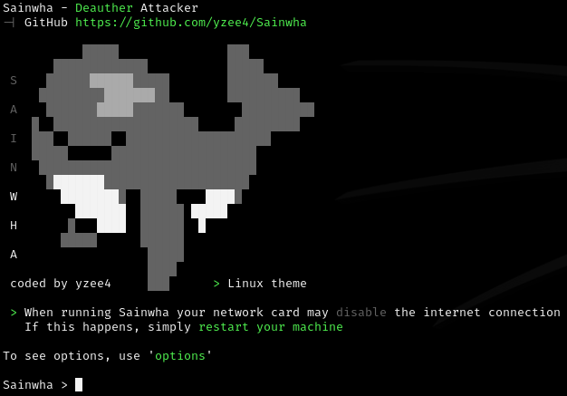
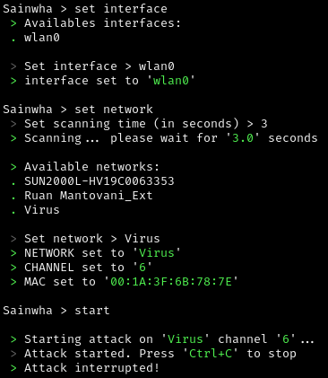
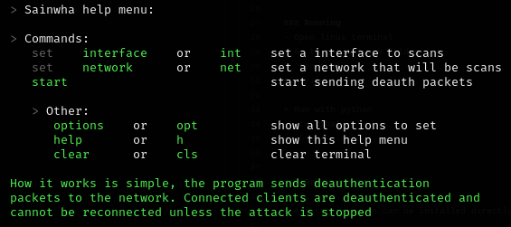

# Sainwha

[![License][1]][2]

[1]: https://img.shields.io/badge/License-MIT-brightgreen.svg

[2]: LICENSE

 How it works is simple, the program sends deauthentication
 packets to the network. Connected clients are deauthenticated and 
 cannot be reconnected unless the attack is stopped. [See more](https://en.wikipedia.org/wiki/Wi-Fi_deauthentication_attack).

#  

> [!CAUTION]
> Your network card may be disabled while the program is running.

> [!NOTE]
> The program is under development, possibly has errors.

### Installation
- Open linux terminal
```terminal
git clone https://github.com/yzee4/Sainwha.git
```

### Running
- Open linux terminal
> Go to the Sainwha folder
```terminal
cd Sainwha
```
> Run with python
```terminal
python3 sainwha.py
```

### Requirements

> All requirements can be installed directly on the terminal

   - `Python3` For running program. To install use `sudo apt install python3`
   - `Nmap` For scans all networks and sends deauthentication packets. To  install use `sudo apt install nmap`
   - `Net-tools` For set interface to scans. To install use `sudo apt install net-tools`
   
#### For help
#  
